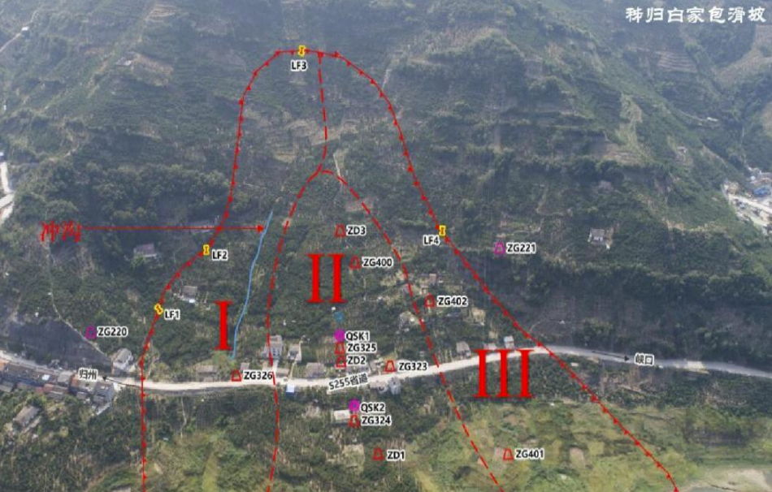
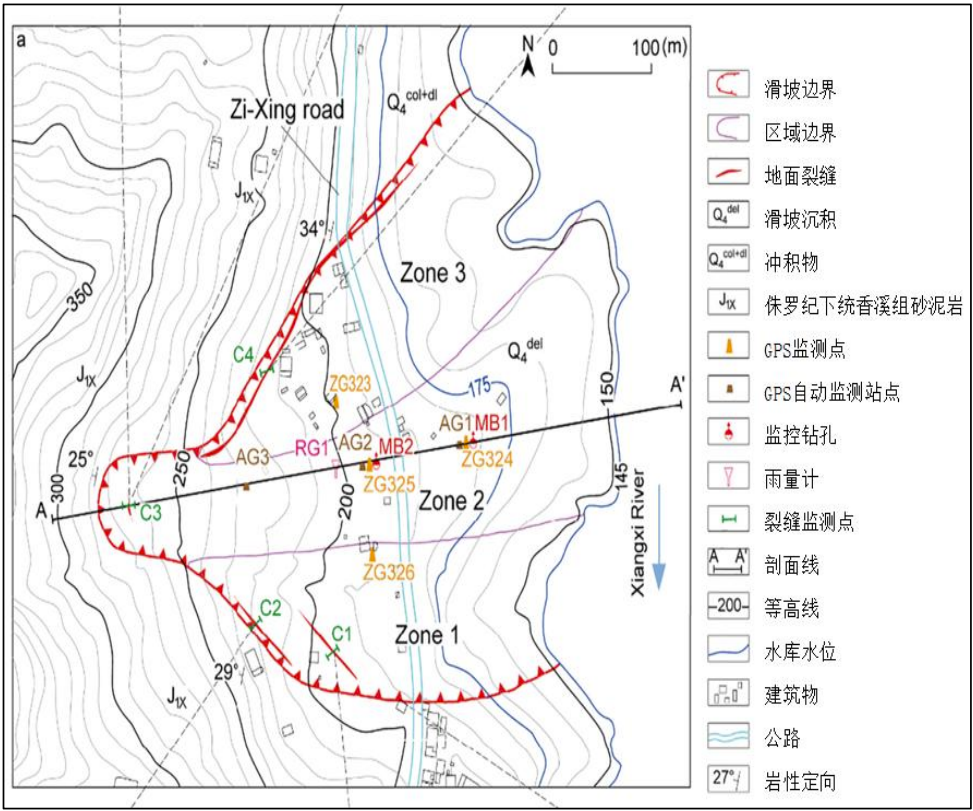
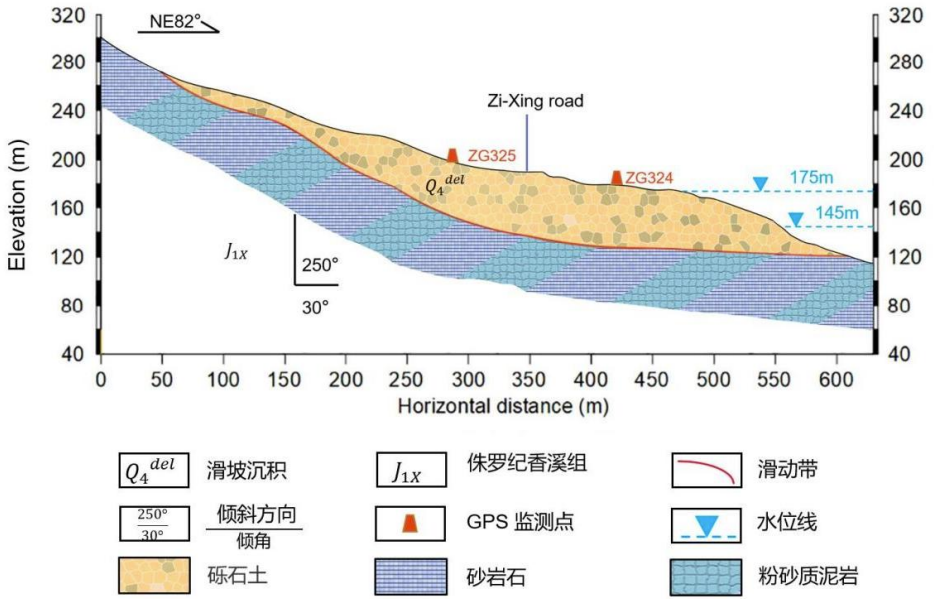
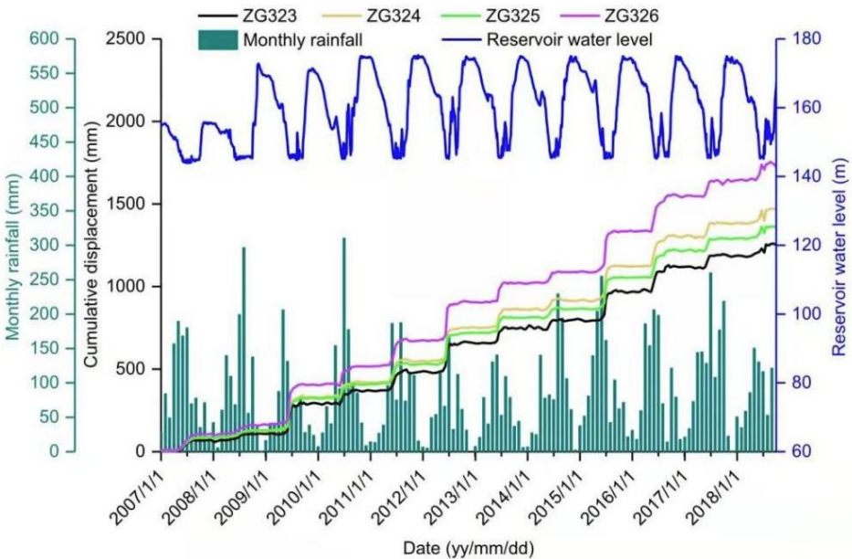

项目名称 基于多尺度卷积与压缩激励网络联合学习框架的门控循环单元的滑坡位移预测

主持国家级、省部级项目9项：
1. 主持国家重点研发计划项目：“黄土滑坡失稳机理、防控方法研究与防治示范（项目编号：2018YFC1504700）” 子课题《课题5黄土滑坡综合防控技术及应用工程示范（课题编号：2018YFC1504705）》专题：基于大数据混合智能优化的黄土滑坡灾害综合防控一体化平台建设，起止时间：2018.12-2021-12，50万。
2. 主持国家自然科学基金：《面向动态武器-目标分配的直觉模糊群体智能优化的局部自适应学习模型与算法研究》，项目编号：61402517，起止时间：2015.01-2017.12.
3. 主持国家重点实验室基金项目（宇航动力学国家重点实验室）：《面向空天防御的直觉模糊群体智能优化的动态武器目标分配研究》，项目编号：2016ADL-DW0302，起止时间：2016.12-2018.12.
4. 主持国家重点实验室基金项目（宇航动力学国家重点实验室）：《基于直觉模糊集理论的目标态势与威胁评估研究》，项目编号：2012ADL-DW0301，起止时间：2012.6-2014.6.
5. 主持中国博士后基金项目：《直觉模糊群体智能优化算法及其在不确定规划中的应用》，项目编号：2013M542331，起止时间：2013.9-2015.12.
6. 主持陕西省重点研发项目（一般工业领域项目）：《融合物理与文化特征的破损陶质文物精细分类关键技术研究》，项目编号：2022GY-331，起止时间：2022.1-2023.12.
7. 主持陕西省自然科学基金项目：《面向破损兵马俑虚拟拼接的直觉模糊群体智能的自适应学习模型研究》，项目编号：2018JM6029，起止时间：2018.1-2019.12。
8. 主持陕西省博士后基金项目：《基于自适应的直觉模糊群体智能优化的多目标优化方法》，起止时间：2015.1-2017.1。
9. 主持陕西省自然科学基金：《直觉模糊优化理论及其在不确定规划中的应用研究》，项目编号：2013JQ8035，起止时间：2013.6-2015.12.

发表论文：
1. Yi Wang, Kanqi Wang, Maosheng Zhang, Tianfeng Gu, Hui Zhang. Reliability-enhanced surrogate-assisted particle swarm optimization for feature selection and hyperparameter optimization in landslide displacement prediction[J]. Complex & Intelligent Systems,https://doi.org/10.1007/s40747-023-01010-w.
2. Yi Wang, Yubo Peng, Li Chen, Yanzhong Duan, Jing Li. WSN node coverage optimization algorithm based on global and neighborhood difference DE[J]. China Communications, 2022, 19 (3) : 212-226.
3. 王毅, 王侃琦, 张茂省, 李静. 基于直觉模糊Memetic框架的双粒子群混合优化算法[J]. 电子学报, 2021,49 (6): 1041-1049.
4. 王毅, 李晓梦, 耿国华, 周琳, 段焱中. 基于直觉模糊熵的混合粒子群优化算法[J]. 电子学报2021, 49 (12) : 2381-2389.
5. Wusi Yang, Li Chen, Yi Wang*, Maosheng Zhang. A reference points and intuitionistic fuzzy dominance based particle swarm algorithm for multi/many-objective optimization[J]. Applied Intelligence, 2020, 50(8):1133-1154. [SCI: 000519350900009] [SCI-3区]
8. Wusi Yang, Li Chen*, Yi Wang, Maosheng Zhang. Multi/Many-Objective Particle Swarm Optimization Algorithm Based on Competition Mechanism[J]. Computational Intelligence And Neuroscience, 2020, 20(2) :1-26.  [SCI: 000518667700001] [SCI-3区]
9. Cundong Tang, Li Chen, Yi Wang, Wusi Yang, Rui Chen, Zhiping Wang.The Role of 5G Network Image Information Based on Deep Learning in UAV Prediction Target Trajectory Tracking. Hindawi Wireless Communications and Mobile Computing, 2021:1-13. Article ID: 3097031.https://doi.org/10.1155/2021/3097031
10. 杨五四，陈莉*，王毅，张茂省，一种适应度排序的高维多目标粒子群优化算法[J], 西安电子科技大学学报, 2021,48(3):1-8. [EI期刊源]
11. WANG Yi, LIU San-yang, Li Jin. Dynamic Weapon Target Assignment Based on Intuitionistic Fuzzy Entropy of Discrete Particle Swarm[J]. China Communcations, 14(1) : 169-179, 2017.  [SCI: 00392633300015]
12. WANG Yi, LIU San-yang, LIU Kai. Threat assessment method based on intuitionistic fuzzy similarity measurement reasoning with orientation[J]. China Communcations, 2014, 11 (6) :119~128. [SCI: 000338916200014]
13. 王毅, 刘三阳, 张文, 王亚男. 属性权重不确定的直觉模糊多属性决策的威胁评估方法[J].电子学报, 2014, 42 (12) : 2509~2515.   [EI:20150500482198]
14. 王毅, 刘三阳, 张文, 孟飞翔. 基于包含度的直觉模糊相似度量推理方法[J]. 系统工程与电子技术, 2014, 36(3) : 494-500.   [EI : 20141617586342]

撰写并出版的著作
1. 王毅.《物联网技术及应用》，北京：国防工业出版社， 2011.6. ISBN :978-7-118-07437-6
2. 雷英杰，王毅. 《直觉模糊集理论及其应用》, 北京：科学出版社, 2014.06
3. 李卫中，王毅. 《XXX武器系统计算机设备原理》,军通教材, 2013.5.
4. 雷英杰，路艳丽，王毅，申晓勇. 《模糊逻辑与智能系统》，西安：西安电子科技大学出版社，2016。12.
5. 黄文龙，王晓丹，王毅，肖宇. 《模式分类的集成方法》，北京：国防工业出版社，2015.11

专利与软著：以第一作者受理专利5项，软著1项。
1. 王毅, 王侃琦, 张茂省, 李静, 段焱中, 李晓梦. 基于直觉模糊密母PSO-LSTM的滑坡位移预测方法. 中国，202110244201.6. 2021. 
2. 王侃琦, 王毅, 张茂省, 段焱中, 李静, 李晓梦. 基于多拓扑分级协同粒子群LSTM的滑坡位移预测方法. 中国, 202110244197.3. 2021.3.
3. 王毅, 段焱中, 张茂省, 彭钰博, 王侃琦. 基于SVR-LSTM混合深度学习的滑坡位移预测方法. 中国, 202110081495.5. 2021. 
4. 王毅, 李晓梦, 耿国华, 周琳, 彭玉博, 王侃琦. 基于混沌反向学习的鲸鱼优化的破损佣体碎片配准方法. 中国, 202110220089.2. 2021. 
5. 王毅, 李静, 周琳, 彭钰博, 段炎中. 基于压缩激励网络的CNN-GRU滑坡位移预测方法及应用. 中国, 202110780377.3. 2021.
6. 王毅, 张鹏辉, 彭钰博, 李静, 张慧.基于柯西扰动麻雀优化的稀疏LSTM滑坡动态预测方法. 中国, 202111015764.4. 2021.
7. 王毅, 李静, 彭钰博. 一种基于EDF-DE模型的三维图像配准方法及应用. 中国, 202110792216.6. 2021.
8. 耿国华，刘小通，王毅，徐嘉晨，王瑶瑶. 基于三维卷积神经网络的点云物体类型识别方法. 发明专利号: 201910034966.x , 2019。
9. 王毅，张慧，张鹏辉，洪国栋. 基于直觉模糊小生境技术鲸鱼优化的兵马俑碎片分类方法. 发明专利号:202211692750.0, 2022.
10. 王毅，郑宏志，王智波，闫小婕，李启航. 一种文物碎片精细分类方法、系统、介质、设备及终端. 发明专利号:202310171272.7, 2023.

## 一、项目简介（200字以内）
我国三峡地区滑坡灾害频发，防灾减灾形势严峻，建立高效的计算智能预测模型已成为国家的重大需求。本项目应用变模态分解（VMD）位移分量，首次提出多尺度卷积（MCNN）-压缩激励网络(SE.NET)的联合学习框架，并结合门控循环递归单元（GRU），建立混合深度学习模型（MCNN-SE-GRU）实现滑坡位移预测。采用MCNN分别提取了3种不同尺度的卷积核获取全局与局部的触发因素特征；并通过SE构建通道间的依赖关系，动态调整特征的通道权重；利用GRU对时序数据之间的依赖关系进行特征提取与预测。可有效抑制滑坡位移蠕动缓慢期预测结果的随机波动以及发生阶跃性变形特征时的精准预测。

## 二、项目相关研究现状及发展动态（不少于200字）
三峡地区滑坡在变形演化过程中，在水库水位与降雨量的共同作用下位移曲线呈阶跃状，具体表现为在旱季时滑坡变形速度较慢，在雨季时滑坡变形剧烈位移曲线突增。对于这种阶跃型滑坡，在短期内滑坡的加速变形会增大风险预警难度，为了实现精准的滑坡剧烈变形期位移预测，需要提出更加智能化的高精度位移预测模型，从而帮助降低滑坡灾害对环境和经济造成的巨大损失，并为设计滑坡灾害防治措施提供足够的对策。

近年来国内外众多学者对于滑坡位移预测问题展开了大量研究，距今为止已经提出了多种滑坡位移预测模型，如经验分析法、时间序列方法、机器学习方法和深度学习方法。传统的滑坡位移预测大多基于各种学科理论知识，通过已有经验进行滑坡变形预估，但这种方法比较依赖经验判据，且不能实现精准的滑坡位移预测。时间序列分析方法也可以用于滑坡位移预测问题中，如 Verhulst 模型、自回归模型和指数平滑模型，但是这些基于时间序列分析的预测方法只能针对相对平稳的线性数据进行预测，难以处理诱因复杂的阶跃型滑坡位移数据。基于机器学习模型可以对复杂的问题建模的优势，一些学者将 SVM、随机森林等方法应用到滑坡位移预测中，但是传统机器无法有效捕获滑坡变形过程中的各种高维触发因素特征，并且其预测结果需要依赖复杂的特征工程。

由于深度学习模型能有效地描述数据特征，近年来被广泛应用于视觉信息计算、音视频处理、自然语言处理等领域，为滑坡位移预测问题提供了新思路，神经网络模型成为了滑坡位移预测的有力工具。Niu 等以陕西土石接触带滑坡为例，建立了反向传播网络滑坡预警模型，并通过对真实滑坡位移数据集进行预测，证明了该模型的有效性；Deng 等针对白水河滑坡展开研究，提出了基于粒子群优化的 ELM 模型实现了位移预测。Huang等以三峡库区白水河滑坡和八字门滑坡为例，提出了一种多元混沌 ELM 模型，并通过实验证明了多元混沌的 ELM 比基于粒子群优化的 SVM 具有更优秀的位移预测性能。虽然这类线性神经网络能够实现滑坡位移预测任务，但由于滑坡位移数据常常在时间维度上存在复杂的相关性，上述模型无法在时间域中获取更多的隐含依赖关系，导致预测精度有待提高。长短时记忆网络（LSTM）与门控循环单元（GRU）模型够按照时间顺序对数据递归计算，更加适用于时间序列预测任务，近年来在各种预测领域得到了广泛应用。Xing 等将 LSTM 应用到了白水河滑坡位移预测研究中，实验证明 LSTM 模型与 ELM 相比具有更高的预测精度。Zhang 等使用 GRU 建立滑坡位移预测模型，并将其应用于三峡地区多因素诱发的二道河滑坡，证明了 GRU 比 SVM 模型具有更高的预测精度。另外，随着神经网络模型的不断创新与发展，近年来卷积神经网络结构也开始应用于时间序列预测问题中。时序卷积网络（TCN）基于卷积神经网络强大的特征提取能力以及自身独特的组织结构，成为了时间序列建模的有效工具。但目前该模型在滑坡位移预测领域仍缺少应用，预测效果有待验证。

另外，随着研究的深入，更多学者发现使用分解方法将阶跃型总位移分解为平滑的趋势项位移和具有明显周期性波动特征的周期项位移并对各项位移分别预测，可以消除阶跃型位移曲线对预测结果的影响，从而得到更准确的位移预测结果。杜鹃等通过移动平均法将累积位移分解，分别采用多项式拟合法和反向传播网络对趋势项位移和周期项位移进行预测，实验结果证明使用位移分解方法能够取得更好的预测效果；周超等应用小波分析法将三峡库区八字门滑坡位移分解为具有不同频率的位移分量，对各特征分量进行空间重构并采用 ELM 进行预测，研究结果表明通过小波分解方法得到的预测结果比直接使用ELM 得到的预测结果更加准确，证明了分解方法的优势；Han 等以三峡地区白水河滑坡为例，采用 EEMD 对累积位移进行分解，对趋势分量预测采用多项式拟法预测，对周期分量预测采用粒子群优化的 ELM 模型预测，最终取得有效预测结果；Xu 等采用 EMD 将白家包滑坡的累积位移分为趋势分量和周期分量，使用多项式曲线和 LSTM 模型分别对位移的趋势分量和周期分量进行预测，验证了 LSTM 相比 SVR、BPNN 具有更好的预测性能；Guo 等以三峡库区欧塘滑坡为例，通过 VMD 方法将滑坡的“阶梯式”位移分解为趋势位移、周期位移和随机位移，并提出了一种基于灰狼优化算法与 BP 神经网络的混合模型，实现了对研究区域滑坡位移的有效预测。

综上，结合累积位移分解方法与深度学习模型对滑坡位移值进行预测，成为当前阶跃型滑坡位移预测研究的主流方法。

## 三、项目实施的目的、意义（不少于200字）
中国是地质灾害频发地区，2022 年全国共发生地质灾害 4772 起，其中滑坡发生 2335 起、崩塌 1746 起、泥石流 374 起、地面塌陷 285 起、地裂缝 21 起、地面沉降 11 起，造成直接经济损失 4096 亿元，涉及可能造成伤亡人员 2.6 万人。图 1 为 2018 年至 2022 年近五年的各类地质灾害数量，其中蓝色为发生滑坡灾害起数，近五年滑坡均占地质灾害比例最大。滑坡灾害不仅对人类的生命安全和财产安全造成伤害，扰乱人类正常的生产生活活动，而且还会对周围环境、地质构造、生物多样性造成二次伤害，给灾后重建工作带来阻力。我国每年在防治滑坡灾害中投入巨大的人力和财力，而得到的收益都相差甚远。从我国的滑坡分布上看，西南地区和中南地区发生滑坡灾害的频率最高。位于陕北地区的黄土高原，该地区黄土滑坡最大特点是受降雨影响，居民的挖坡建窑改变了斜坡的应力状态，长期以来危及广大人民群众生命财产安全，如 2019 年子洲县 8.13大暴雨事件，诱发了大堡岔滑坡，造成 5 人死亡的危险事故。三峡地区的地质条件复杂，由三峡大坝蓄水，滑坡均分布在长江两岸，区域内有多条河流汇入长江，对滑坡坡脚造成侵蚀，形成高陡岸坡，当地多暴雨，滑坡灾害泛滥。山地和丘陵较多的地区，滑坡的坡顶和坡底具有较大的高度差，在重力和山坡角度作用下，滑坡造成的灾害更大，频繁破坏通信设备、居民住所、交通道路，严重制约当地经济发展，滑坡带来的损失是无法挽回的。

由此可见，滑坡已成为三峡地区重要的地质灾害问题，开展滑坡灾害研究刻不容缓。为了应对滑坡自然灾害，近年来有大量的研究围绕三峡地区滑坡问题展开。众多学者从滑坡稳定性分析、滑坡变形因素分析以及滑坡位移预测等方面进行了研究。其中，通过高精度的滑坡位移预测研究能够实现滑坡灾害预警，对灾害防治具有重要的现实意义。为了进一步深入和完善滑坡位移研究工作，有必要提出高性能的智能化模型，并从数值上提高位移的预测精度，从而实现灾前预警并推动开展防灾减灾行动，更好地保障人民的生命财产安全。

## 四、项目研究内容和拟解决的关键问题（不少于300字）
拟解决的关键问题：
1. 如何更准确地识别和挖掘滑坡成因及影响因素，揭示其相互关联性和作用机制。
2. 面临海量多源数据时，如何进行有效的融合与处理，避免信息过载，并最大程度地利用这些数据为滑坡预测提供支持。
3. 如何建立高精度、稳定性强且具有普适性的滑坡预测模型，以满足不同区域和条件下的预测需求。
4. 如何利用现有的监测数据实现对三峡地区这种诱发因素众多的阶跃型滑坡位移值精准预测。
5. 滑坡位移在蠕动缓慢期预测结果的随机波动以及发生阶跃变形时的预测结果不准确问题。
6. 区域内多个滑坡监测点位移预测效率低的问题。

~~5. 模型ELM、BPNN、LSTM、GRU在平缓蠕变期与发生阶跃突变期的预测结果表现不同，且预测曲线出现随机波动和不准确性。~~
~~4. 如何科学地进行滑坡风险评估，为防灾减灾决策提供有效的参考依据。~~
~~5. 如何设计实用、易操作且反应迅速的滑坡预警系统，提高预警信息的传递效率和实施时效。~~

项目研究内容：
1. 滑坡成因及影响因素分析：深入研究滑坡的地质、气象、人类活动等诱发因素，探讨其相互关联性和作用机制，为滑坡风险评估与预测提供理论依据。
2. 多源数据融合与处理：收集并整合各种滑坡相关数据信息源，包括遥感数据、地形地貌数据、地质构造数据、气象数据和滑坡历史事件数据等，进行有效的数据处理和分析。
3. 针对该地区阶跃型滑坡位移曲线拟合难度较大的问题，研究 VMD 算法，将滑坡总位移分解为由坡体内部结构所演化的趋势项位移和外界影响因素所引起的周期项位移，去充分挖掘各监测点之间的联系，以为后续实验中对各项位移单独预测能得到更精确的预测结果，提高预测能力。
4. 针对滑坡诱发因素的合理选择问题，从定性和定量的角度深度对滑坡影响因素进行分析，研究灰色关联度分析法去筛选滑坡变形的关键诱发因素，以为实现滑坡位移的精准预测提供有效的数据支撑。
5. 针对单一深度学习模型在多诱因的阶跃型滑坡位移预测问题上的局限性，研究一种基于多尺度卷积（MCNN）和压缩-激励网络（SENet）并结合门控循环递归单元（GRU）的混合深度学习模型（MCNN-SE-GRU）来实现混合深度学习模型用于滑坡单点位移预测。使用多种不同尺度的卷积核，以形成不同大小的感受野，用于获取全局与局部的触发因素特征；并尝试通过SE模块学习全局与局部信息，构建通道间的依赖关系，动态调整特征的通道权重，强化重要特征抑制非重要特征。
6. 尝试通过通道注意力机制动态调整特征的通道权重，提高网络的特征表达能力。研究 GRU 模块用于识别输入信息在时间上的依赖关系实现时序特征的提取。
7. 尝试将多重特征进行拼接融合，通过全连接层线性回归计算多点位移预测值。

~~3. 滑坡预测模型的建立与优化：应用变模态分解（VMD）理论，并且采用一种基于多尺度卷积（MCNN）和压缩-激励网络（SENet）并结合门控循环递归单元（GRU）的混合深度学习模型 （MCNN-SE-GRU），结合多源数据，建立高精度且具有实用价值的滑坡预测模型，并不断对模型进行优化与调整，以提高滑坡预测准确性。~~
~~4. 滑坡风险评估：基于滑坡预测模型，对滑坡可能发生的区域和时间进行风险评估，为防灾减灾决策提供科学依据。~~
~~5. 预警系统设计与实施：设计易于理解和操作的滑坡预警系统界面，实现滑坡预测结果的快速传递与报警功能，提高滑坡防治工作的实效性。~~

~~1. 针对白家包滑坡的地质特征，研究变模态分解（VMD）算法，将滑坡总位移分解为趋势项位移和周期项位移，并通过灰色关联度分析法确定主要触发因素，为实现滑坡位移的精准预测提供有效的数据支撑。~~
~~2. 针对单一深度学习模型在多诱因的阶跃型滑坡位移预测问题上的局限性，研究一种并行结构的时序卷积与门控循环单元（TCN-GRU）混合深度学习模型用于滑坡单点位移预测，并取得了令人满意的预测结果。~~
~~3. 针对区域内滑坡点众多时模型预测效率低的问题，研究基于多尺度卷积与通道注意力机制结合门控循环单元（MCSGRU）的多点联合位移预测模型，能够充分挖掘各监测点之间的联系，提高了预测能力。该研究的创新点在于结合了VMD、多尺度卷积和通道注意力等方法，提高了深度学习模型的预测能力和效率，为滑坡预测提供了更加有效的方法。~~

## 五、项目研究与实施的基础条件（不少于300字）
为了进行滑坡预测，首先需要对研究区域的地质构造、地质材料特性和地形条件进行详细的了解是滑坡预测研究的基础。地质和地形基础提供了滑坡发生的环境背景和地质条件，为滑坡预测模型的建立提供重要的基础数据。

滑坡预测需要依靠大量的数据支撑，包括地质地形数据、遥感影像数据、气象数据、地下水位数据、地震数据等，这些数据需要具备高质量、高精度、高时效性等特点，以保证滑坡预测的准确性和及时性。因此需要获取相应的历史数据，历史滑坡数据是进行滑坡预测研究的重要基础。收集和分析过去发生的滑坡事件，包括滑坡的规模、位置、形态、触发因素等信息，可以揭示滑坡的特征和规律，为预测模型的构建提供参考。对于获取实时数据，需要在预测地点已经建立传感器监测网络，其能够实时、连续、精准地监测地表位移、地下水位、地震等数据，并将数据传输给数据处理中心，以实现对滑坡的实时预警和预测。

目前已经收集到白家包滑坡的基本概况，白家包滑坡位于我国三峡库区周边，滑坡区域面积高达 22 万平方米。白家包滑坡属于堆积体滑坡，各处滑坡堆积物厚度在空间分布上具有不均匀的特征。深层变形区域平均厚度约 45 米，滑体体积约 990 万立方米；浅层滑坡区域平均厚度约 30 米，滑体体积约 730 万立方米，平面形态呈短舌状（如图 2 所示）。
白家包滑坡涉水香溪河，附近地形高差悬殊，地貌复杂，水文特征表现为每年雨季时期强降雨发生频繁，雨水的冲刷与入渗岩土对当地的地质环境造成了巨大的影响。由于香溪河水位变化受三峡水库蓄水直接控制，导致滑坡涉水程度不断变化，当坡脚涉水且汇水面积较大时，河域附近的滑坡体含水率与内部结构会发生较大的变化。白家包滑坡全貌图、工程地质平面图、剖面图如图 2、图 3、图 4 所示。

白家包滑坡区域内设置了四个距离较近的 GPS 位移监测点，各监测点的具体分布如图 3 所示。分析每个监测点的位移、降雨量、库水位数据变化情况，从图 5 可以看出，四个监测点的时间位移曲线均呈现出“台阶状”特征。具体表现为，在库水位下降明显、降雨量较大的雨季（每年 6~7 月），滑坡容易发生剧烈变形，位移曲线呈阶跃式增长；在三峡水库蓄水期以及降雨量少的时期，滑坡变形程度较小。自 2007 年开始进行人工监测后，白家包四个人工 GPS 监测点均发生了较大程度的形变，每个点的滑坡位移曲线虽然具有相同的演化趋势，但由于空间分布不同，各监测点位移变化幅度也不相同。其中，监测点 ZG326 始终保持着较大的位移值，ZG323 保持着较小的位移值。

项目的指导老师团队实验室现有相关研究论文Reliability-enhanced surrogate-assisted particle swarm optimization for feature selection and hyperparameter optimization in landslide displacement prediction（滑坡位移预测中特征选择和超参数优化的可靠性增强代理辅助粒子群优化）；专利《基于直觉模糊密母PSO-LSTM的滑坡位移预测方法》、《基于多拓扑分级协同粒子群LSTM的滑坡位移预测方法》、《基于SVR-LSTM混合深度学习的滑坡位移预测方法》、《基于压缩激励网络的CNN-GRU滑坡位移预测方法及应用》、《基于柯西扰动麻雀优化的稀疏LSTM滑坡动态预测方法》、基于三维卷积神经网络的点云物体类型识别方法等。可以为我们的研究提供坚实的基础。实验室现配备有机器学习相关计算机十余台、显卡（RTX3080）等相关设备若干，可以为项目后续建立深度学习模型的训练提供硬件基础。

## 六、项目实施方案（不少于300字）
1. 数据采集与处理
   - 数据采集：利用卫星遥感、激光雷达、无人机等先进技术与监测设备，高效并准确地收集地质地形、气象、地下水位和地震等相关数据。
   - 数据预处理：严格按照标准流程进行数据处理和质量控制，确保数据的完整性、准确性和可靠性。通过综合多种数据和信息（如地形、水文、气象、地质、土地利用和人口等），全面分析各种因素对滑坡的影响。
2. 模型构建与优化
   1. 由于滑坡在发育过程中受内在的控制因素和外部诱发因素的共同作用，其位移变化曲线在趋势上呈现阶梯状。在预测滑坡位移的过程中，也有学者采用直接对滑坡原始的累计位移曲线进行分析和预测的方法，但该方法未考虑滑坡的内在机理，容易做出错误判断。因此，采用分解算法将原始位移序列分解成不同子序列，对子序列分别采用模型进行预测是当今准确预测滑坡位移变化的有效手段。前人研究所用的主要分解方法为 EMD、集合经验模态分解（EEMD） 、小波变换等。对原始序列进行分解，一方面能够充分利用原始位移中的有效信息，使得整个位移预测更加符合滑坡的变形机理和特征; 另一方面能够降低数据的冗余和复杂度，计算速度快，可有效提升工作效率。但是小波变换、EMD和EEMD这些分解方法虽然可以将滑坡位移分解成多个位移分量，然而分解后的数量不确定，导致触发因素不能与位移分量有效关联。本项目所采用的变分模态分解（VMD）方法能改进传统经验模态分解方法因信号分量受噪声影响过大而无法 提取有效信息的问题，且对于滑坡的位移变形有阶跃性特征时效果较好。 变分模式分解VMD（Variational Mode Decomposition，VMD）是一种将非平稳信号分解为一组变频、变幅的固有模态函数（Intrinsic Mode Functions，IMF）的方法。与传统的EMD（经验模态分解）和其改进算法如CEEMD（改进的经验模态分解）相比，VMD利用了信号的全局信息，使得分解结果更为准确。VMD的提出主要是解决EMD的混沌问题，核心是把EMD的固有模态模型变成可变换的模型，通过迭代改变成可以频率以及带宽进行调节限制的IMF来达到最优。类似于小波函数和傅里叶级数变化的关系，都是将固有不变的问题转化成变得问题。不同的是，VMD函数不需要基函数的选取，通过频域分解得到不同的谐波信号，目标是求各个模态的带宽之和最小，为了保证分解的准确性，约束条件是，所有模态之和等于原始信号，保证了分解后的信号通过叠加可以得到原始信号。限定判别精度 $e \gt 0$ ，通过计算，若条件满足 $\sum\left\|\hat{u}_{k}^{n+1}-\hat{u}_{k}^{n}\right\|_{2}^{2} /\left\|\hat{u}_{k}^{n}\right\|_{2}^{2}<\mathbf{e}$ 证明循环结束，得到最终的K个窄带的IMF分量，并且还可以通过相加得到原信号，有效地避免了混沌的发生。
   2. 因为造成滑坡位移的因素复杂多样，如果只使用一种深度神经网络是无法提取出不同程度的深层次特征，并且不同的特征对滑坡位移的影响的权重是不同的，同时为了保证得到较高的预测精准度。因此，本项目将采用一种特殊的结合多种技术的神经网络，采用基于多尺度卷积（MCNN）和压缩-激励网络（SENet）并结合门控循环递归单元（GRU）的混合深度学习模型（MCNN-SE-GRU），用来实现周期与随机位移的预测。MCNN（Multi-column Convolutional Neural Network）是一种卷积神经网络模型，用于图像识别和分类任务。与传统的卷积神经网络不同，MCNN具有多列卷积层并行的结构，每列卷积层的滤波器大小和数量都可以不同，以捕捉不同尺度的特征。每一列卷积层都有自己的权重矩阵，并对输入图像进行卷积运算，然后将结果合并在一起，以获得更准确的特征表示。MCNN还可以在卷积层和池化层之间插入归一化层，以进一步提高性能。MCNN的训练是通过反向传播算法实现的，它在训练过程中可以适应不同尺度和复杂度的图像。MCNN的特点是可以对图像进行多层次的特征提取，并且可以在不同卷积层之间共享特征，使得模型的复杂度和训练时间得到有效的控制。采用MCNN模块可以对诱发因素的多尺度特征提取。克服现有深度神经网络采用单一卷积核无法同时提取高维全局与局部特征信息的不足。
   3. 因为不同的诱发滑坡的因素对滑坡位移的影响不同，所以不能将所以的影响因素同等看待，所以本项目拟使用SEnet是一种神经网络结构，用来强化重要特征，同时抑制非重要特征。SEnet全称为“Squeeze-and-Excitation Network”，中文名为“压缩与激励网络”。SEnet的目的是通过自适应地对每个通道进行加权来提高模型的性能。在传统的卷积神经网络中，每个卷积层都有一定数量的通道，而每个通道的权重在整个网络的训练过程中都是固定的。但是，不同的通道在不同的特征提取方面可能 具有不同的重要性，它的创新之处在于它通过一种称为“Squeeze-and-Excitation”模块的结构来学习每个通道的重要性，并在每个卷积层上动态地调整通道的权重。 SEnet的核心思想是，通过全局信息来计算每个通道的重要性，并将这些重要性作为每个通道的权重。具体来说，SEnet包括两个关键组件：Squeeze和Excitation。Squeeze模块是一个全局平均池化层，它将每个通道的特征压缩为一个数字。这个数字可以被看作是该通道的重要性。接下来，Excitation模块将这个数字作为输入，并输出一个权重向量。该权重向量用于加权每个通道的特征，从而使具有更高重要性的通道更受重视。使用SEnet可以带来很多优点。首先，它可以显著提高模型的性能，特别是在一些需要较高精度的任务中。其次，SEnet具有较小的计算成本，因为Squeeze模块只需要一个全局平均池化操作，而Excitation模块只需要几个全连接层。最后，SEnet可以与许多不同的神经网络结构集成，包括ResNet、Inception等。GRU的关键创新在于引入了门控机制，以控制信息的流动和记忆的更新。与LSTM相比，GRU的记忆单元更简单，只有一个隐藏状态，减少了模型的参数量和计算开销。
   4. 为了保证较高的预测精度，同时减少神经网络的训练时间，采用GUR神经网络模型。GRU（Gated Recurrent Unit）是一种循环神经网络（RNN）的变体，用于处理序列数据的建模和预测。它是在LSTM（Long Short-Term Memory）模型的基础上提出的，旨在解决LSTM中存在的一些计算复杂性和记忆单元的不必要复杂性问题。
3. 模型验证与应用
   - 以三峡地区的白家包滑坡为例，使用已构建的滑坡位移预测模型进行实际数据分析和验证，评估模型在实际应用中的效果和性能。
   - 根据模型预测结果，制定针对性的防灾减灾措施，提高对滑坡的预警和预防能力，保障人民群众的生命财产安全。
4. 持续优化与改进
   - 随着新数据的不断收集和技术的更新升级，对模型进行持续优化和改进，以适应不同地区和环境条件下的滑坡预测需求。
   - 加强多学科交叉合作，充分利用地质学、土力学、水文学、气象学、遥感技术等领域的专业知识，深入研究滑坡形成的原因和机制，为滑坡预测和预防提供更全面准确的科学依据。

本方案通过先进的数据采集技术、数据处理方法、滑坡位移预测模型以及跨学科的研究方法，系统地解决了滑坡预测过程中的痛点问题。有效地提高了滑坡预测的准确性和可靠性，为防灾减灾工作提供了有力支持。

## 七、项目创新点及特色（不少于300字）
1. 采用变分模式分解方法(VMD)对原始位移序列进行数据尺度的自适应分解，得到趋势项位移、周期项位移和随机项位移，建立触发因素与位移分量的有效关联，使得分解后每个位移分量具有明确的物理意义。进而通过多项式函数预测趋势位移，采用VMD计算周期位移与随机位移的高频与低频分量并通过灰色关联度确定主要触发因素。
2. 首次构建MCNN-SE框架，采用MCNN模块分别提取了3种不同尺度的卷积核，形成了不同大小的感受野，获取了全局与局部的触发因素特征；并利用SE模块学习全局与局部信息，构建通道间的依赖关系，动态调整特征的通道权重，强化重要特征抑制非重要特征。有效解决现有深度学习预测模型未考虑多源外界诱发因素中丰富的多尺度信息以及各影响因素对触发滑坡位移程度的影响。
3. 设计了特征融合模块，将MCNN-SE提取到的高维多尺度时空特征信息与GRU模块提取到的时序特征信息拼接融合，得到新的全局特征向量，并由两个全连接层实现对全局特征向量的线性回归计算。
4. 通过与主流的BPNN、ELM、LSTM、GRU动态预测模型以及MCNN、CNN、SE与GRU的不同组合模型的实验对比分析，表明了MCNN-SE模型能够深入挖掘触发因子不同尺度的特征信息，并根据影响程度自动获取触发因子的特征权重，极大提高GRU的预测性能，可有效抑制滑坡位移蠕动缓慢期预测结果的随机波动以及发生阶跃性变形特征时的精准预测。

## 八、已有基础（包括与本项目有关的研究积累和已取得的成绩、学校可以提供的条件、尚缺少的条件及解决方法）
- 研究积累与成绩：目前，我们的团队已完成了数据采集阶段，收集到了白家包滑坡的基本概况。现在处于进行算法研究阶段。拟采用变分模式分解方法（VMD）对原始位移序列进行处理，使用 MCNN-SE 框架和特征融合模块。这些突破性成果为滑坡位移预测提供了高准确性和可靠性。
- 导师团队：项目的指导老师团队实验室现有相关研究论文Reliability-enhanced surrogate-assisted particle swarm optimization for feature selection and hyperparameter optimization in landslide displacement prediction（滑坡位移预测中特征选择和超参数优化的可靠性增强代理辅助粒子群优化）；专利《基于直觉模糊密母PSO-LSTM的滑坡位移预测方法》、《基于多拓扑分级协同粒子群LSTM的滑坡位移预测方法》、《基于SVR-LSTM混合深度学习的滑坡位移预测方法》、《基于压缩激励网络的CNN-GRU滑坡位移预测方法及应用》、《基于柯西扰动麻雀优化的稀疏LSTM滑坡动态预测方法》、基于三维卷积神经网络的点云物体类型识别方法等。可以为我们提供技术指导以及专家资源等方面的支持，帮助我们在软件系统开发过程中解决可能遇到的问题。
- 学校实验室：实验室现配备有机器学习相关计算机十余台、显卡（RTX3080）等相关设备若干，可以为项目后续建立深度学习模型的训练提供硬件基础。

~~解决条件不足：尚缺少软件开发人员和资金支持，我们计划在接下来几个月内积极寻求种子轮融资，并招募相关领域的软件开发人才，以支持软件系统的开发和市场推广。~~
直接开干。

尚缺少的条件及解决方法：
~~1. 数据量不足：虽然我们已经完成了数据采集阶段，但是对于滑坡预测来说，需要的数据量很大。因此，我们需要进一步扩大数据采集范围和深入挖掘数据信息，以提高模型的准确性和可靠性。~~
1. 模型训练时间过长：在深度学习中，模型的训练时间通常会很长。为了节省训练时间，我们可以使用基于GPU的并行计算技术，并采用一些优化策略，如动态规划、参数初始化等方法，以加速模型训练。
2. 可视化系统不完善：针对该项目，我们需要建立一个可视化系统，方便用户进行数据查询和分析。我们可以选择一些成熟的可视化工具，并结合自身的需求进行二次开发，以满足项目特定的需求。 ~~如Tableau、PowerBI等，~~
~~3. 实时监测系统不完善：目前，在滑坡位移预警领域，实时监测是非常重要的。因此，我们需要建立一个实时监测系统，通过对数据源的持续监测，及时发现异常情况并进行预警。我们可以选择一些成熟的监测系统，如Zabbix、Nagios等，并进行二次开发，以满足自身的需求。~~

## 九、项目研究进度安排及各阶段预期成果(本栏内容为中期检查及结题答辩重要参考)
1. 第一阶段（1-3个月）：完成团队组建，招聘软件开发人员和UI设计师等关键岗位；同时完成种子轮融资筹备工作，争取尽快获得资金支持。预期成果：团队组建完成，融资筹备工作就绪。
2. 第二阶段（3-9个月）：进行软件系统的开发工作，包括前端和后端的编程、用户界面设计以及数据接口的实现。同时，对系统进行内部测试和优化，确保系统稳定可靠。预期成果：完成软件系统的主要开发工作，具备初步运行功能。
3. 第三阶段（9-11个月）：进行软件系统的内测和外部测试，收集用户反馈，对系统进行进一步优化和改进。同时，着手准备市场推广工作，包括制定营销策略、寻找合作伙伴等。预期成果：软件系统测试完成，市场推广策略确定。
4. 第四阶段（11-12个月）：正式推向市场，积极开展宣传推广活动，争取吸引更多用户使用我们的软件系统。根据市场需求，持续优化产品性能，并寻求与更多行业领域的合作。预期成果：取得良好市场反馈，实现与多个行业领域的合作。

